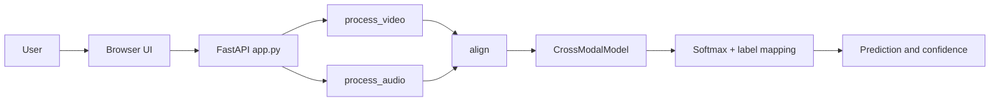
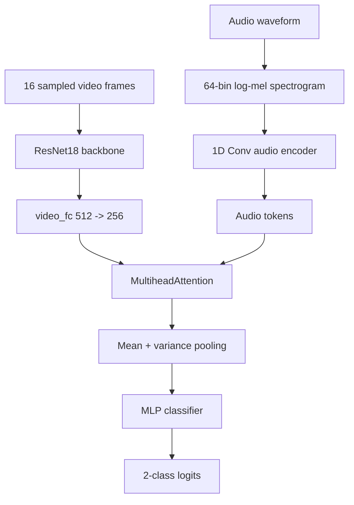

# VerifyAI Deepfake Analyser

VerifyAI is a cross-modal deepfake detection project that combines visual frames and audio features to classify a video as `REAL` or `FAKE`.

The repository includes:

- A FastAPI app with a browser UI at `/`
- A Streamlit dashboard for interactive exploration
- A command-line inference script
- The custom PyTorch model definition used to load `model_final.pth`
- Video and audio preprocessing utilities
- A Docker image that runs the FastAPI UI on port `8000`

## System Architecture



## Model Architecture



## End-to-End Process

1. The user opens the browser UI or the Streamlit dashboard.
2. The app accepts an uploaded video or the bundled `sample.mp4` clip.
3. `process_video()` decodes the video with `decord.VideoReader`.
4. Exactly 16 frames are sampled uniformly.
5. If the clip has fewer than 16 decodable frames, the last frame is repeated.
6. Frames are resized to `224x224` and normalized with ImageNet mean and standard deviation.
7. `process_audio()` decodes the audio track with `decord.AudioReader` at `16000 Hz` mono.
8. If audio decoding fails, the code falls back to `ffmpeg` extraction and `librosa` loading.
9. A 64-bin log-mel spectrogram is computed with `n_fft=1024` and `hop_length=512`.
10. `align()` trims both modalities to the same sequence length.
11. `CrossModalModel` extracts visual and audio features, fuses them with multi-head attention, and produces logits.
12. `softmax()` converts logits into a probability distribution.
13. The final response returns a label and a confidence score.

## Repository Layout

```text
deepfake_detection/
|-- app.py
|-- streamlit_app.py
|-- inference.py
|-- model_custom.py
|-- utils.py
|-- styles.py
|-- model_final.pth
|-- sample.mp4
|-- requirements.txt
|-- Dockerfile
|-- .dockerignore
`-- README.md
```

## Runtime Interfaces

| Path | Method | Purpose |
| --- | --- | --- |
| `/` | `GET` | HTML landing page with upload and sample controls |
| `/health` | `GET` | JSON health check for the API |
| `/predict` | `POST` | Multipart upload endpoint that returns `REAL` or `FAKE` |
| `/sample.mp4` | `GET` | Bundled demo video used by the UI |
| `/docs` | `GET` | FastAPI OpenAPI docs |

## How The Model Works

### Video branch

- `resnet18(weights=None)` is used as the visual backbone.
- The classification head is removed.
- Frame embeddings are projected from `512` to `256` dimensions with `video_fc`.

### Audio branch

- The audio waveform is converted to a `64 x T` log-mel spectrogram.
- A small 1D convolution stack maps the spectrogram to `256` channels.

### Fusion and classification

- Audio tokens attend over the video tokens through `nn.MultiheadAttention`.
- The attended sequence is summarized with mean and variance statistics.
- A small MLP produces the final 2-class output.

## Local Development

Install the Python dependencies:

```bash
pip install -r requirements.txt
```

Run the FastAPI web app:

```bash
python app.py
```

Open:

```text
http://127.0.0.1:8000/
```

Run the Streamlit dashboard:

```bash
streamlit run streamlit_app.py
```

Run CLI inference:

```bash
python inference.py --video sample.mp4
```

## Docker

The Docker image runs the FastAPI app on port `8000`.

Build the image:

```bash
docker build -t verifyai-deepfake-analyser .
```

Run it locally:

```bash
docker run --rm -p 8000:8000 verifyai-deepfake-analyser
```

Push to Docker Hub:

```bash
docker tag verifyai-deepfake-analyser:latest neelsamaiyar/verifyai-deepfake-analyser:latest
docker push neelsamaiyar/verifyai-deepfake-analyser:latest
```

## GitHub Publishing Flow

The project is prepared to be pushed to:

```text
https://github.com/neelsamaiyar29/VerifyAI-Deepfake-Analyser
```

The repo includes the model code, inference code, UI, Docker config, and the bundled sample video so the project can be cloned and run without extra setup.

## Notes

- `model_final.pth` must stay next to `app.py` and `inference.py`.
- `sample.mp4` is the bundled demo clip used by the browser UI and Streamlit app.
- The FastAPI app returns a full HTML landing page at `/`, so the root URL is no longer just a JSON response.
- The preprocessing pipeline is shared by the web app, Streamlit app, and CLI inference so results stay consistent.
